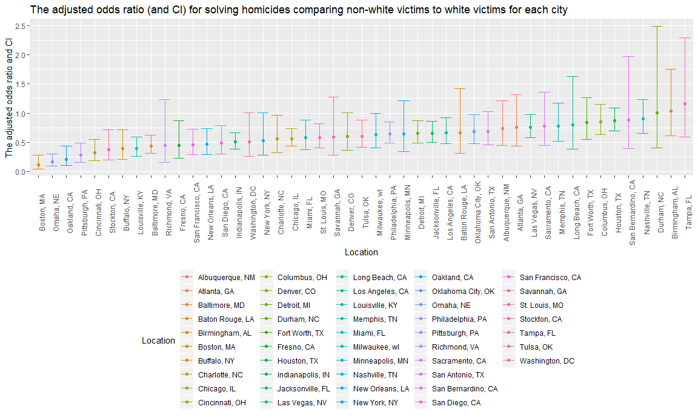
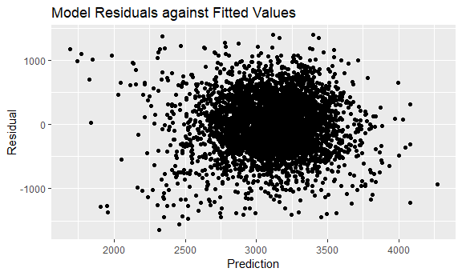
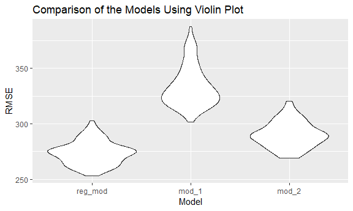

p8105\_hw6\_yw3095
================
Yixuan Wang
November 27, 2018

Problem 1
---------

This problem focuses on homicides in 50 large U.S. cities.

**Upload and Clean the Data.**

``` r
raw_data = read_csv(file = "./data/homicide-data.csv") %>% 
  janitor::clean_names() 

homicide = raw_data %>%  
  mutate(city_state = paste(city, state, sep = ", "),
         resolved = as.numeric(disposition == "Closed by arrest"),
         victim_age = ifelse(victim_age == "Unknown", NA, as.integer(victim_age)),
         victim_race = ifelse(victim_race == "White", "white", "non-white"),
         victim_race = fct_relevel(victim_race, "white")) %>% 
  select(resolved, victim_age, victim_race, victim_sex, city_state) %>% 
  filter(!city_state %in% c("Dallas, TX", "Phoenix, AZ", "Kansas City, MO", "Tulsa, AL"))
```

**Using Data from Baltimore to do a Logistic Regression.**

``` r
bal_fit_logistic = homicide %>% 
  filter(city_state == "Baltimore, MD") %>% 
  glm(resolved ~ victim_age + victim_race + victim_sex, data = ., family = binomial()) 

save(bal_fit_logistic,file = "bal_fit_logistic.RData") 

bal_fit_logistic %>% 
  broom::tidy() %>% 
    janitor::clean_names() %>% 
    mutate(OR = exp(estimate),
           conf_low = exp(estimate - 1.96*std_error),
           conf_high = exp(estimate + 1.96*std_error)) %>% 
    select(term, OR, conf_low, conf_high) %>% 
    knitr::kable(digits = 3) 
```

| term                  |     OR|  conf\_low|  conf\_high|
|:----------------------|------:|----------:|-----------:|
| (Intercept)           |  3.274|      2.067|       5.186|
| victim\_age           |  0.993|      0.987|       0.999|
| victim\_racenon-white |  0.441|      0.313|       0.620|
| victim\_sexMale       |  0.412|      0.315|       0.537|

**Apply This Regression Model to All Cities.**

``` r
fit_logistic = function(x){
    homicide %>% 
    filter(city_state == x) %>% 
    glm(resolved ~ victim_age + victim_race + victim_sex, data = ., family = binomial()) %>%  
    broom::tidy() %>% 
    janitor::clean_names() %>% 
    mutate(OR = exp(estimate),
           conf_low = exp(estimate - 1.96*std_error),
           conf_high = exp(estimate + 1.96*std_error)) %>%
    filter(term == "victim_racenon-white") %>% 
    select(beta = estimate, OR, conf_low, conf_high)
}

city_model = 
  tibble(city_state = unique(homicide$city_state)) %>% 
  mutate(map(.x = unique(homicide$city_state), ~fit_logistic(.x))) %>% 
  unnest 
```

**Making a plot to show the adjusted odds ratio (and CI) for solving homicides comparing non-white victims to white victims for each city**

``` r
city_plot = city_model %>% 
  ggplot(aes(x = reorder(city_state, OR), y = OR, colour = city_state)) + 
  geom_point() +
  geom_errorbar(aes(ymin = conf_low, ymax = conf_high), width = 0.8) +
  labs(
    title = "The adjusted odds ratio (and CI) for solving homicides comparing non-white victims to white victims for each city",
    x = "Location",
    y = "The adjusted odds ratio and CI",
    color = "Location"
  ) + 
  theme(legend.position = "bottom", axis.text.x = element_text(angle = 90))
city_plot
```



From the plot above, we can know that Boston, MA has the highest adjusted odds ratio for solving homicides comparing non-white victims to white victims, and Tampa, FL has the lowest odds ratio. Durham, NC has the widest confidence interval.

Problem 2
---------

In this problem, we tried to understand the effects of several variables on a child’s birthweight.

**Uploaded and Cleaned the Data.**

``` r
birthweight = read_csv(file = "./data/birthweight.csv") %>%
  janitor::clean_names()  

birthweight = birthweight %>% 
  mutate(babysex = as.factor(babysex),
         frace = as.factor(frace),
         malform = as.factor(malform),
         mrace = as.factor(mrace))

skimr::skim(birthweight)
```

    ## Skim summary statistics
    ##  n obs: 4342 
    ##  n variables: 20 
    ## 
    ## -- Variable type:factor -------------------------------------------------------------------------------------------------------------
    ##  variable missing complete    n n_unique                      top_counts
    ##   babysex       0     4342 4342        2         1: 2230, 2: 2112, NA: 0
    ##     frace       0     4342 4342        5 1: 2123, 2: 1911, 4: 248, 3: 46
    ##   malform       0     4342 4342        2           0: 4327, 1: 15, NA: 0
    ##     mrace       0     4342 4342        4 1: 2147, 2: 1909, 4: 243, 3: 43
    ##  ordered
    ##    FALSE
    ##    FALSE
    ##    FALSE
    ##    FALSE
    ## 
    ## -- Variable type:integer ------------------------------------------------------------------------------------------------------------
    ##  variable missing complete    n      mean     sd  p0  p25    p50  p75 p100
    ##     bhead       0     4342 4342   33.65     1.62  21   33   34     35   41
    ##   blength       0     4342 4342   49.75     2.72  20   48   50     51   63
    ##       bwt       0     4342 4342 3114.4    512.15 595 2807 3132.5 3459 4791
    ##     delwt       0     4342 4342  145.57    22.21  86  131  143    157  334
    ##   fincome       0     4342 4342   44.11    25.98   0   25   35     65   96
    ##  menarche       0     4342 4342   12.51     1.48   0   12   12     13   19
    ##   mheight       0     4342 4342   63.49     2.66  48   62   63     65   77
    ##    momage       0     4342 4342   20.3      3.88  12   18   20     22   44
    ##    parity       0     4342 4342    0.0023   0.1    0    0    0      0    6
    ##   pnumlbw       0     4342 4342    0        0      0    0    0      0    0
    ##   pnumsga       0     4342 4342    0        0      0    0    0      0    0
    ##      ppwt       0     4342 4342  123.49    20.16  70  110  120    134  287
    ##    wtgain       0     4342 4342   22.08    10.94 -46   15   22     28   89
    ##      hist
    ##  <U+2581><U+2581><U+2581><U+2581><U+2585><U+2587><U+2581><U+2581>
    ##  <U+2581><U+2581><U+2581><U+2581><U+2581><U+2587><U+2581><U+2581>
    ##  <U+2581><U+2581><U+2581><U+2583><U+2587><U+2587><U+2582><U+2581>
    ##  <U+2581><U+2587><U+2585><U+2581><U+2581><U+2581><U+2581><U+2581>
    ##  <U+2581><U+2582><U+2587><U+2582><U+2582><U+2582><U+2581><U+2583>
    ##  <U+2581><U+2581><U+2581><U+2581><U+2582><U+2587><U+2581><U+2581>
    ##  <U+2581><U+2581><U+2581><U+2585><U+2587><U+2582><U+2581><U+2581>
    ##  <U+2582><U+2587><U+2585><U+2582><U+2581><U+2581><U+2581><U+2581>
    ##  <U+2587><U+2581><U+2581><U+2581><U+2581><U+2581><U+2581><U+2581>
    ##  <U+2581><U+2581><U+2581><U+2587><U+2581><U+2581><U+2581><U+2581>
    ##  <U+2581><U+2581><U+2581><U+2587><U+2581><U+2581><U+2581><U+2581>
    ##  <U+2581><U+2587><U+2586><U+2581><U+2581><U+2581><U+2581><U+2581>
    ##  <U+2581><U+2581><U+2581><U+2587><U+2587><U+2581><U+2581><U+2581>
    ## 
    ## -- Variable type:numeric ------------------------------------------------------------------------------------------------------------
    ##  variable missing complete    n  mean   sd    p0   p25   p50   p75 p100
    ##   gaweeks       0     4342 4342 39.43 3.15 17.7  38.3  39.9  41.1  51.3
    ##     ppbmi       0     4342 4342 21.57 3.18 13.07 19.53 21.03 22.91 46.1
    ##    smoken       0     4342 4342  4.15 7.41  0     0     0     5    60  
    ##      hist
    ##  <U+2581><U+2581><U+2581><U+2581><U+2583><U+2587><U+2581><U+2581>
    ##  <U+2581><U+2587><U+2585><U+2581><U+2581><U+2581><U+2581><U+2581>
    ##  <U+2587><U+2581><U+2581><U+2581><U+2581><U+2581><U+2581><U+2581>

Exploring the dataset, we found that there was no missing value in the dataset. The mean value of variable parity (number of live births prior to this pregnancy) was 0.0023, which shows that there were few live births prior to this pregency. Thus, all values for varibles pnumlbw (previous number of low birth weight babies) and pnumsga (number of prior small for gestational age babies) were 0, which was resonable.

**Build a linear regression model**

``` r
full_model = lm(bwt ~ ., data = birthweight)

stepwise = step(full_model, direction = "both", trace = 0)
stepwise
```

    ## 
    ## Call:
    ## lm(formula = bwt ~ babysex + bhead + blength + delwt + fincome + 
    ##     gaweeks + mheight + mrace + parity + ppwt + smoken, data = birthweight)
    ## 
    ## Coefficients:
    ## (Intercept)     babysex2        bhead      blength        delwt  
    ##   -6098.822       28.558      130.777       74.947        4.107  
    ##     fincome      gaweeks      mheight       mrace2       mrace3  
    ##       0.318       11.592        6.594     -138.792      -74.887  
    ##      mrace4       parity         ppwt       smoken  
    ##    -100.678       96.305       -2.676       -4.843

``` r
reg_model = lm(bwt ~ babysex + delwt + gaweeks + mrace + ppwt, data = birthweight)
summary(reg_model)
```

    ## 
    ## Call:
    ## lm(formula = bwt ~ babysex + delwt + gaweeks + mrace + ppwt, 
    ##     data = birthweight)
    ## 
    ## Residuals:
    ##      Min       1Q   Median       3Q      Max 
    ## -1638.71  -265.41     5.01   280.57  1392.22 
    ## 
    ## Coefficients:
    ##              Estimate Std. Error t value Pr(>|t|)    
    ## (Intercept)  371.7298    92.0942   4.036 5.52e-05 ***
    ## babysex2     -82.8022    13.0749  -6.333 2.65e-10 ***
    ## delwt          9.6760     0.6057  15.976  < 2e-16 ***
    ## gaweeks       53.5144     2.1344  25.073  < 2e-16 ***
    ## mrace2      -248.0147    13.7639 -18.019  < 2e-16 ***
    ## mrace3       -24.0251    66.5549  -0.361  0.71813    
    ## mrace4      -104.1606    29.2879  -3.556  0.00038 ***
    ## ppwt          -5.0237     0.6628  -7.579 4.22e-14 ***
    ## ---
    ## Signif. codes:  0 '***' 0.001 '**' 0.01 '*' 0.05 '.' 0.1 ' ' 1
    ## 
    ## Residual standard error: 429.7 on 4334 degrees of freedom
    ## Multiple R-squared:  0.2971, Adjusted R-squared:  0.296 
    ## F-statistic: 261.7 on 7 and 4334 DF,  p-value: < 2.2e-16

First, I used step-wise selection as a data-driven model-building process and got a linear regression model with 11 variables. And then I did some literature view work. According to article "Prediction of Birth Weight", I chose babysex, mother's weight at delivery, gestational age, mother's race, and mother's pre-pregnanacy weight as predictors in my final linear regression model.

**Making a plot to show model residuals against fitted values**

``` r
model_plot_df = birthweight %>% 
  add_predictions(model = reg_model) %>%
  add_residuals(model = reg_model)

ggplot(model_plot_df, aes(x = pred, y = resid)) +
    geom_point() +
    labs(
      title = "Model Residuals against Fitted Values",
      x = "Prediction",
      y = "Residual"
    )
```



From the plot above, we found that the residuals "bounce randomly" around the line residual = 0; points roughly form a "horizontal band" around the line residual = 0; there were no obvious outliers in the plot. We can assume that it met the criteria of a well regression model.

**Compared my model with two models provided using violin plot.**

``` r
cv_bwt_df =
  crossv_mc(birthweight, 100) %>% 
  mutate(train = map(train, as_tibble),
         test = map(test, as_tibble))

cv_bwt_df_test = 
  cv_bwt_df %>% 
  mutate(reg_mod = map(train, ~lm(bwt ~ bhead + blength + mrace + delwt + gaweeks + smoken + ppbmi + babysex + parity + ppwt + fincome, data = .x)),
         mod_1 = map(train, ~lm(bwt ~ blength + gaweeks, data = .x)),
         mod_2 = map(train, ~lm(bwt ~ bhead * blength * babysex, data = .x))) %>% 
  mutate(rmse_reg_mod = map2_dbl(reg_mod, test, ~rmse(model = .x, data = .y)),
         rmse_mod_1 = map2_dbl(mod_1, test, ~rmse(model = .x, data = .y)),
         rmse_mod_2 = map2_dbl(mod_2, test, ~rmse(model = .x, data = .y)))
```

``` r
cv_bwt_df_test %>% 
  select(starts_with("rmse")) %>% 
  gather(key = model, value = rmse) %>% 
  mutate(model = str_replace(model, "rmse_", ""),
         model = fct_inorder(model)) %>% 
  ggplot(aes(x = model, y = rmse)) + geom_violin() + 
  labs(
    title = "Comparison of the Models Using Violin Plot",
    x = "Model",
    y = "RMSE")
```



From the plot above, we found that my model had the lowest RMSE which was much better than two provided models. Besides, from the plot "Model Residuals against Fitted Values", we concluded that it met the criteria of a well regression model. So my model was more appropriate than other two models.
